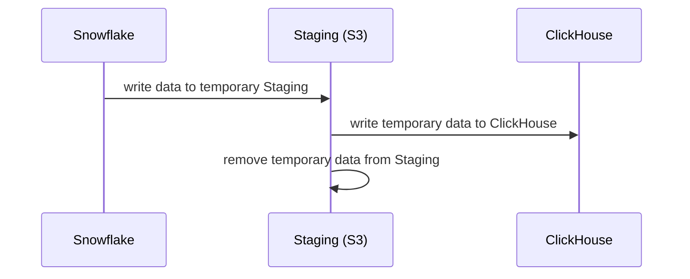

As the name suggests, a staging model is one that uses a staging platform to ingest data from one source to one output that is not directly supported. An example of this is ingesting from Snowflake to ClickHouse. In order to support our user's varying set ups, we've devised staging models. 


## When to use a Staging Model?
Staging models are required for situations where the input and output type are not directly supported. However, by using a staging platform that is supported by both platforms, it allows a user to temporarily write data to the staging platform and ingest directly to the output platform.

:::note Supported Paths
Staging Models is in ongoing development, while we do have support for the following, please [reach out to us](contact.md) if you have any specific requirements.

Snowflake --> S3 --> ClickHouse

:::

### Example 
Let's expand further on the Snowflake to ClickHouse example. 


In the above example, during the ingestion from Snowflake to Clickhouse, we use the temporary staging table in S3 to write from Snowflake to S3, then from S3 to ClickHouse. Once this procedure is complete, we clear the temporary data from S3.

### Sample YAML:

```yaml
# Use DuckDB to generate a range of days from 1st Jan to today
partitions:
  connector: duckdb
  sql: SELECT range as day FROM range(TIMESTAMPTZ '2024-01-01', now(), INTERVAL 1 DAY)

# Don't reload previously ingested partitions on every refresh
incremental: true

# Query Snowflake for all events belonging to the current partition
connector: snowflake
sql: SELECT * FROM events WHERE date_trunc('day', event_time) = '{{ .partition.day }}'

# Since ClickHouse can't ingest from Snowflake or vice versa, we use S3 as a temporary staging connector
stage:
  connector: s3
  path: s3://bucket/temp-data

# Produce the final output into ClickHouse, requires a clickhouse.yaml connector defined.
output:
  connector: clickhouse
```


