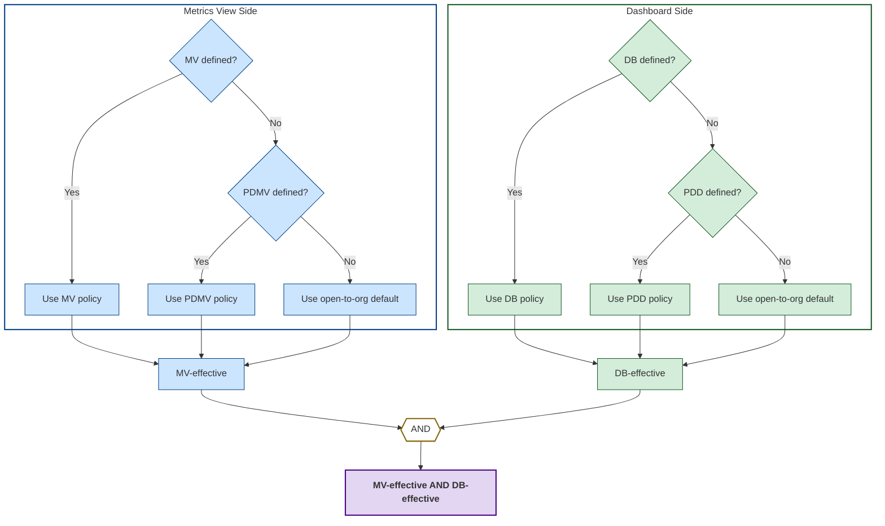

# Debugging Dashboard Access

Dashboard access and data control are fundamental aspects of Rill, offering multiple configuration options for securing your dashboards. This complexity can sometimes lead to access issues that require troubleshooting.

This guide provides essential troubleshooting steps and solutions to quickly resolve dashboard access problems and restore dashboard functionality.

:::note 

This guide assumes you have already set up and understand [dashboard and data access policies](/build/metrics-view/security). 

:::

## Where to Start

There are three main types of data access issues you might encounter in Rill:

1. [**403 Permission Denied**](#troubleshooting-general-access-issues): Dashboard not shown in the project
2. [**Failed to Load Dashboard**](/build/debugging/dashboard-access#troubleshooting-row-access-filters): "This dashboard currently has no data to display. This may be due to access permissions."
3. [**Canvas Dashboard Component Failed to Load**](#canvas-dashboards)

The troubleshooting approach depends on which type of error you're experiencing.

:::tip Not an Admin or Editor?

If you don't have admin or editor access, or access to the underlying GitHub repository, you'll need to contact your internal team to resolve the issue.

:::

## Where Are Policies Defined?

In Rill, policies are defined at two levels:
- **Project defaults** in `rill.yaml`
- **Object-level policies** in individual resource files

For detailed information about policy configuration, refer to our [data access policy documentation](/build/metrics-view/security#creating-access-policies).

Once you've identified where these policies are defined, you can begin troubleshooting the specific issue.


## Secutiry Policies Visualized



**Abbreviations:**
- **MV**: Metrics View Policy
- **PDMV**: Project Default Metrics View Policy  
- **DB**: Dashboard Policy
- **PDD**: Project Default Dashboard Policy

For a full table of possible combinations, see [tables of examples](/build/debugging/dashboard-access#table-of-examples).

## Troubleshooting General _Access_ Issues

**How it's surfaced**: The dashboard doesn't appear in the project view, or a component isn't showing in the metrics view.

Don't forget the behavior for security policies:

```bash
Project Defaults < (Metrics View YAML AND Dashboard YAML)
```

**Check these levels in order:**

1. **Project defaults**: Are there project-level access policies? [Yes/No]
2. **Metrics view policies**: Are there object-level metrics view policies? [Yes/No] (This overrides project defaults)
3. **Dashboard policies**: Are there object-level dashboard policies? [Yes/No] (This overrides project defaults)
   
:::tip No policies in object level?
Even if you have no policies defined in the metrics view, any policies defined in the project level will get added dynamically. Don't forget to add the project defaults in your calculations! See our [table of examples](#table-of-examples) for all the possible combinations.

:::

**Example policy structure:**

```sql
('{{ .user.admin }}' OR '{{ .user.domain }}' == 'example.com') AND ('{{ has "partners" .user.groups }}')
```

This policy would only allow:
- Admins who are part of the "partners" group, OR
- Users with "example.com" domain who are part of the "partners" group

:::tip Checking User Groups

You can verify your user group membership through:
- **UI**: https://ui.rilldata.com/your_org/-/users/groups
- **CLI**:
```bash
rill usergroup list
rill user list --group group_name
```
:::

### Canvas Dashboards

Canvas dashboards reference multiple metrics views. If you're missing components from specific metrics views, check the `access` parameter for each individual metrics view.

 <br/>


## Troubleshooting _Row Filters_ Issues

**How it's surfaced**: The data displayed in the dashboard is not being filtered properly.

Don't forget the behavior for security policies:

```bash
Project Defaults < (Metrics View YAML)
```

**Check these levels in order:**

1. **Project defaults**: Are there project-level access policies? [Yes/No] 
2. **Metrics view policies**: Are there object-level metrics view policies? [Yes/No] (This overrides project defaults)

Note that dashboards don't apply here since `row_filter` is set on metrics views only.

:::tip No policies in object level?
Even if you have no policies defined in the metrics view, any policies defined in the project level will get added dynamically. Don't forget to add the project defaults in your calculations! See our [table of examples](#table-of-examples) for all the possible combinations.

:::


## Table of Examples

<div class="rounded-gif">

| Project Default Metrics View                  | Project Default Dashboard                         | Metrics View                                                                       | Dashboard                                                                         | Resulting                                                                                                                  |
| --------------------------------------------- | ------------------------------------------------- | ---------------------------------------------------------------------------------- | --------------------------------------------------------------------------------- | -------------------------------------------------------------------------------------------------------------------------- |
| _not defined_                                 | _not defined_                                     | _not defined_                                                                      | _not defined_                                                                     | **All dashboards open** to org users                                                                                       |
| _not defined_                                 | _not defined_                                     | _not defined_                                                                      | `access: '{{ has "partners" .user.groups }}'`                                     | Dashboard accessible to users in **usergroup**, "partners"                                                                 |
| _not defined_                                 | _not defined_                                     | `access: '{{ has "partners" .user.groups }}'`                                      | _not defined_                                                                     | Dashboard accessible to users in **usergroup**, "partners"                                                                 |
| _not defined_                                 | _not defined_                                     | `access: '{{ has "partners" .user.groups }}'`                                      | `access: "'{{ .user.domain }}' == 'example.com'"`                                 | Dashboard accessible to users in **usergroup**, "partners" AND **domain** ending in "example.com"                          |
| _not defined_                                 | `access: false`                                   | _not defined_                                                                      | _not defined_                                                                     | No Dashboards are accessible _(From Project Default)_                                                                      |
| _not defined_                                 | ~~`access: false`~~                               | _not defined_                                                                      | `access: "'{{ .user.domain }}' == 'example.com'"`(**overwrites** project default) | Dashboard accessible to user **domain** ending in "example.com"                                                            |
| _not defined_                                 | `access: '{{ has "partners" .user.groups }}'`     | `access: "'{{ .user.domain }}' == 'example.com'"`                                  | _not defined_                                                                     | Dashboard accessible to users in **usergroup**, "partners" _(From Project Default)_ AND **domain** ending in "example.com" |
| _not defined_                                 | ~~`access: '{{ has "partners" .user.groups }}'`~~ | `access: "'{{ .user.domain }}' == 'domain.com'"`                                   | `access: '{{ has "external" .user.groups }}'` (**overwrites** project default)    | Dashboard accessible to users in **usergroup**, "external" AND **domain** ending in "domain.com"                           |
| `access: false`                               | _not defined_                                     | _not defined_                                                                      | _not defined_                                                                     | No Dashboards are accessible _(From Project Default)_                                                                      |
| `access: '{{ has "partners" .user.groups }}'` | _not defined_                                     | _not defined_                                                                      | `access: "'{{ .user.domain }}' == 'example.com'"`                                 | Dashboard accessible to users in **usergroup**, "partners" _(From Project Default)_ AND **domain** ending in "example.com" |
| ~~`access: false`~~                           | _not defined_                                     | `access: "'{{ .user.domain }}' == 'example.com'"` (**overwrites** project default) | _not defined_                                                                     | Dashboard accessible to user **domain** ending in "example.com"                                                            |
| ~~`access: false`~~                           | _not defined_                                     | `access: "'{{ .user.domain }}' == 'example.com'"` (**overwrites** project default) | `access: true`                                                                    | Dashboard accessible to user **domain** ending in "example.com"                                                            |
| `access: false`                               | `access: false`                                   | _not defined_                                                                      | _not defined_                                                                     | No Dashboards are accessible _(From Project Default)_                                                                      |
| `access: false`                               | ~~`access: false`~~                               | _not defined_                                                                      | `access: "'{{ .user.domain }}' == 'example.com'"` (**overwrite** project default) | No Dashboards are accessible _(From Project Default)_                                                                      |
| ~~`access: false`~~                           | `access: true`                                    | `access: "'{{ .user.domain }}' == 'example.com'"` (**overwrites** project default) | _not defined_                                                                     | Dashboard accessible to user **domain** ending in "example.com"                                                            |
| ~~`access: false`~~                           | ~~`access: false`~~                               | `access: "'{{ .user.domain }}' == 'example.com'"` (**overwrites** project default) | `access: '{{ has "partners" .user.groups }}'`(**overwrites** project default)     | Dashboard accessible to users in **usergroup**, "partners" AND **domain** ending in "example.com"                          |
</div>