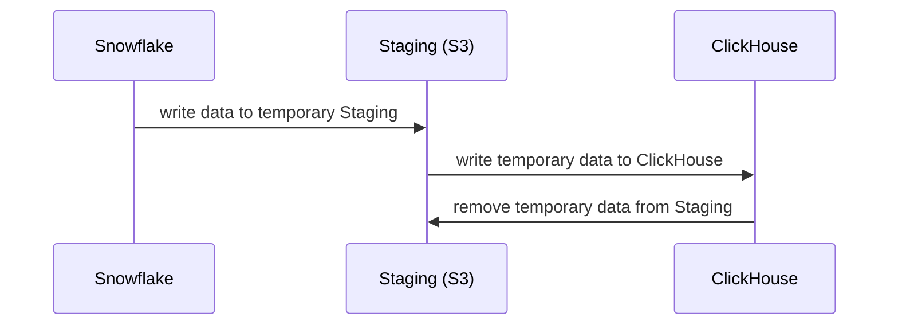

Unlike SQL models, YAML models provide the ability to fine tune a model to perform additional capabilities such as partitions and incremental modeling. This is important as it adds the ability to refresh or load new data in increments thus resulting in decreased down time, and decreased cost of ingestion.


## Types of Advanced Models
The two types of advanced models are Incremental models and Partitioned models. 

1. [Incremental Models](#what-is-an-incremental-model)

2. [Partitioned Models](partitions.md)


## What is an Incremental Model?

Unlike [regular models](../models/models.md) that are created via SQL select queries, incremental models are defined in a YAML file and are useful to:
- decrease cost of ingestion,
- decrease loading time of new data,
- *with partitions* allow the ability to refresh specific portions of data,
- and more! 

Whether your data exists in cloud storage or in a data warehouse, Rill will be able to increment and ingest depending on the settings you define in your model file

:::tip
Incremental Modeling in Rill is an ongoing development, while we do have support for the following, please reach out to us if you have any specific requirements.

Cloud Storage:
S3, GCS

Data Warehouse
BigQuery, Snowflake
:::

## Creating an Incremental Model

 In order to enable incremental model, you will need to set the following: `incremental: true`.
```yaml
type: model

sql: #some sql query from source_table
incremental: true
```


:::tip
Incremental models with neither `state` nor `split` defined will append data per incremental refresh from the source table. This will result in duplicate data and is not recommended.
:::
### Incremental Models with State defined

If your data is not in [partitions](partitions.md), you can define the incremental model with a predefined `state` parameter.

```yaml
type: model
incremental: true

sql: |
     SELECT * FROM TABLE
        {{ if incremental }} WHERE COL_DATE = TO_DATE( '{{ .state.date }}', 'YYYY-MM-DD') + INTERVAL '1 day' {{ end }} 

state:
  sql: SELECT MAX(date) as date FROM TABLE
```

Once state is defined in an incremental model, its value can be used as a variable in your SQL statement. In the above example, the state returns the most recent `date` value from `TABLE` and adds an additional day. Then, the SQL statement will run based on the WHERE clause.


### Staging Models

In the case of ingesting data from unsupport types, such as Snowflake to ClickHouse, you can define a staging table to write the temp data from Snowflake -> Staging Table, then Staging Table -> ClickHouse.



```yaml
# Use DuckDB to generate a range of days from 1st Jan to today
splits:
  connector: duckdb
  sql: SELECT range as day FROM range(TIMESTAMPTZ '2024-01-01', now(), INTERVAL 1 DAY)

# Don't reload previously ingested splits on every refresh
incremental: true

# Query Snowflake for all events belonging to the current split
connector: snowflake
sql: SELECT * FROM events WHERE date_trunc('day', event_time) = '{{ .split.day }}'

# Since ClickHouse can't ingest from Snowflake or vice versa, we use S3 as a temporary staging connector
stage:
  connector: s3
  path: s3://bucket/temp-data

# Produce the final output into ClickHouse
output:
  connector: clickhouse
```

In the above example, we are using splits defined in DuckDB to define a range of days to use in the Snowflake query. The data will be written to a temp-data folder in S3 and written to ClickHouse after. Once completed, the data in temp-data will be cleared.

## Refreshing an Incremental Model

When you are testing with incremental models in Rill Developer, you will notice a change in the refresh functionality. Instead of a full refresh, you are given the option for `incremental refresh`.


When selecting to refresh incrementally what is being run in the CLI is:

```bash
 rill project refresh --local --model <model_name> 
```

Kind in mind that if you select `Full refresh` this will start the ingestion of **all of your data** from scratch. Only use this when absolutely required. When running a full refresh, the CLI command is:

```bash
 rill project refresh --local --model <model_name> --full
```