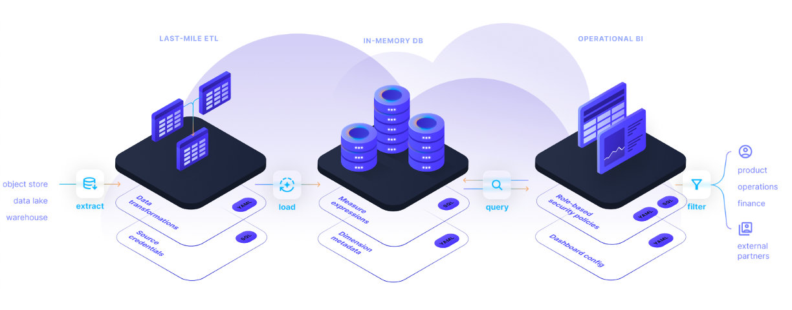

import Tabs from '@theme/Tabs';
import TabItem from '@theme/TabItem';

## Overview

Rill's strategy for fast dashboards is twofold:

1) Define metrics & dimensions up front use these definitions to automatically aggregate and prune the raw tables. This modest modeling pain yields a massive gain: the data footprint is typically 10-100X smaller than the underlying raw sources.

2) Avoid lowest common denominator of database performance. Instead, orchestrate data out of warehouses and lakehouses into OLAP databases

The decoupling of databases and BI tools served a purpose at one phase in the evolution of data stacks, but the cost and performance trade-offs have begun to shift in favor of consolidated analytics offerings.

## Architecture

Engineering teams frequently get ad hoc requests from product, finance, and operations for insights into data sets that are readily available in object storage. Over time, writing complex SQL or Python reports against the data lake can become a burden and a distraction. With Rill, engineering teams can write SQL to design and deploy a small set of data models to answer a broad range of inquiries. Rill’s architecture automatically turns SQL-based data models into interactive, exploratory dashboards with no additional design effort. Engineers can focus on defining expressions for core business metrics in SQL, and Rill takes care of the rest.

Building analytics directly on data storage reduces complexity, because there are fewer moving pieces to manage, and it also lowers costs, because data can be transformed in place without duplication. Rill achieves performance that end users love by serving dashboards from in-memory data models fed by data lake sources.

In short, Rill helps engineering teams leverage the value of their data lake architectures, delighting business users without requiring multiple investments in separate ETL, data warehouse, and BI tools.

