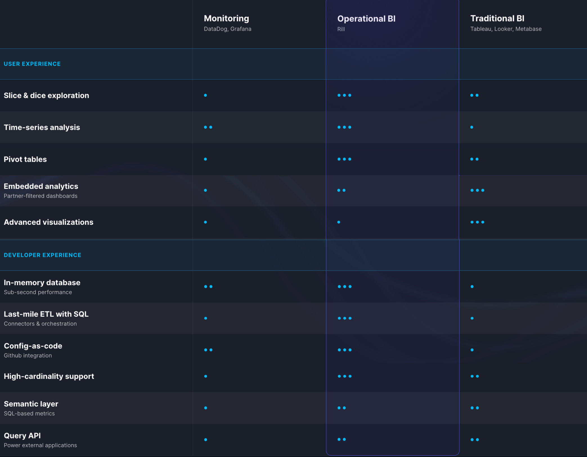
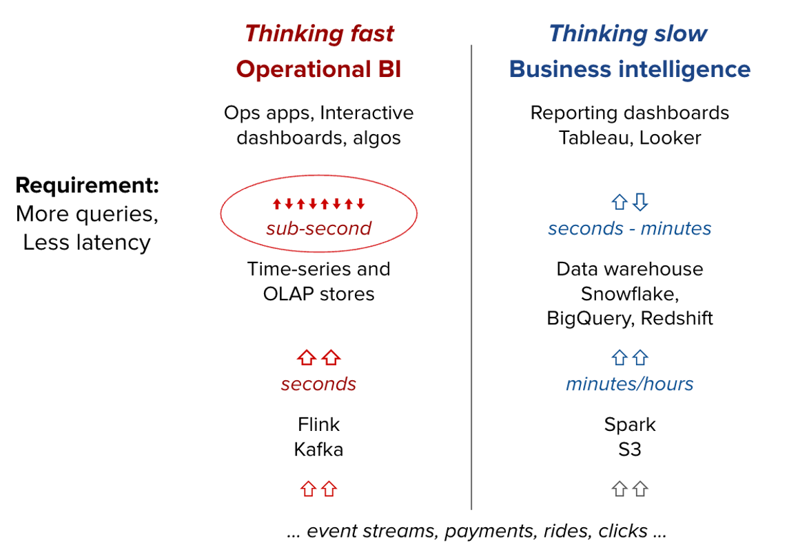

import Tabs from '@theme/Tabs';
import TabItem from '@theme/TabItem';

## Operational vs. Traditional BI

The distinction between operational and business intelligence is analogous to the distinction between fast and slow thinking, as characterized by psychologist Daniel Kahneman in his paper Thinking, Fast and Slow. One system operates quickly and automatically for simple decisions and the other leverages slow and effortful deliberation for complex decisions. 

Ultimately, the output of operational and business intelligence are decisions. Operational intelligence fuels fast, frequent decisions on real-time and near-time data by hands-on operators. Business intelligence drives complex decisions that occur daily or weekly, on fairly complete data sets. 

## Why Operational BI requires new tools

Operational intelligence provides a set of decision-making capabilities that are complementary to business intelligence.  But its unique performance requirements also demand a novel stack of distinct technologies which are complementary and sit adjacent to existing business intelligence stacks.

Analytics technology stacks can be thought of as data flowing into a three-layered cake consisting of ETL, databases, and applications.  The requirements for an operational intelligence stack is that it supports:

- high speed of data from ETL to application
- high frequency, low-latency queries between the database and application layer

In the diagram below we illustrate two common examples for technologies used in operational and business intelligence stacks.

