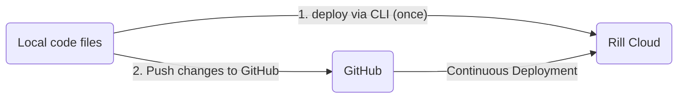

<!-- WARNING: There are links to this page in source code. If you move it, find and replace the links and consider adding a redirect in docusaurus.config.js. -->

## Overview


Deploying dashboards from Rill Developer allows you to share dashboards with other users, leverage [Rill Cloud capabilities](../../explore/dashboard-101), [embed Rill](/integrate/embedding.md) into other applications, and more!

:::tip Configure credentials
Cloud datastores will typically require service keys to access data. Make sure to you create the necessary key for your service account and either add these credetials to your `.env` file directly or deploy your project and then run ```rill env configure``` with the correct credentials. For more details, please refer to our [connector documentation](/build/credentials/credentials.md).
:::

The flow diagram below shows two options for deploying an existing project. 

**Deploy via the UI or CLI using `rill project deploy`**: 

---
**Deploy via the CLI via `rill project connect-github`**:

    
## Deploying a project from Rill Developer
Starting from **v0.48**, we have introduced the possibility to push dashboards _directly from Rill Developer to Rill Cloud_. On the dashboard page, you can select the `Deploy` button and follow the steps to deploy to Rill Cloud.


<br />

Now that you project has been deployed to Rill Cloud, you will need to ensure that your users have access! Please refer to the [user management](../../manage/user-management.md) section. 

If you make changes locally on Rill Developer, you will need to push the contents to Rill Cloud by selecting the `Update` button.


<br />

:::tip On an older version of Rill?

You can easily check the version of Rill that you are using in Rill Developer by running the following command:

```bash
rill --version
```

If you are on an older version of Rill, it is **strongly recommended** to [upgrade](home/install.md#upgrade-to-the-newest-version) to the latest version.

:::

### Syncing your GitHub Repository
:::note GitHub app permissions
This assumes that the installed Github app in your organization has write access. If unsure, please check with your Github admin.

The required permissions are:
 - Read access to metadata and pull requests
 - Read and write access to administration and code 
:::


At this point, you have the option to connect your Rill project to a GitHub Repository.

Navigating to the Status page and selecting `Connect to GitHub` will prompt you to login and create a repository for your project. If you've already created a repository, check the box 'I've created a GitHub Repo' and add the permissions for Rill to access the repository.

:::info Check with your Github organization admin

If you're not the admin of your Github organization, they will likely need to first install the Rill Cloud app in your organization before you can proceed with deploying a project. After the Rill Cloud app is installed, it should have the following privileges:

:::


Once the permissions to the repository have been confirmed and set, you can continue to select the repository in the dropdown.


Once completed, you'll see the newly updated repository on the UI of your status page!


## Deploying a project via the CLI

:::note
Starting from v0.49, we have deprecated `rill deploy` in favor of `rill project deploy` and `rill project connect-github`. For more information on the `rill deploy` command click [here](#deprecated-rill-deploy).
:::

### Deploy project without GitHub Repository
You can add a GitHub Repository later.
```
rill project deploy
Using org "Rill_Learn".

Starting upload.
All files uploaded successfully.

Created project "Rill_Learn/my-rill-tutorial". Use `rill project rename` to change name if required.

...

Your project can be accessed at: https://ui.rilldata.com/Rill_Learn/my-rill-tutorial
Opening project in browser...
```

If you have not already [configured your connections' credentials](https://docs.rilldata.com/build/credentials/), you will be reminded here which connections are required.

**First deployment**

If this is your first deployment to Rill Cloud, you will get prompted to either sign up or log in (if you have an existing account on [Rill Cloud](https://ui.rilldata.com/)). Proceed with the sign up and email verification process for new users or authorization process for existing users. As a new user, you can expect to see the following page:


**Project Uploaded Successfully**

Once the project has been uploaded to Rill Cloud, you should be able to see the following page: 


### Deploy Project with Repository
Follow the instructions in the Terminal to login to GitHub (if not already done so), and select your repository.
If you do not set any parameters, Rill will infer the project name based on the folder path and use this as both the repository and project name. If there are any overlaps, we will request for a new name.
```bash
rill project connect-github
No git remote was found.
? Do you want to create a repo? Yes
? Select a Github account for the new repository royendo
Repository name "my-rill-tutorial" is already taken
? Please provide alternate name my-rill-tutorial-cli

Request submitted for creating repository. Checking completion status

Successfully created repository on "https://github.com/royendo/my-rill-tutorial-cli"

Pushing local project to Github

Successfully pushed your local project to Github

Using org "Rill_Learn".

Created project "Rill_Learn/my-rill-tutorial-cli". Use `rill project rename` to change name if required.

Rill projects deploy continuously when you push changes to Github.

...

Your project can be accessed at: https://ui.rilldata.com/Rill_Learn/my-rill-tutorial-cli
Opening project in browser...
```

Once completed, you will see the following the in the status page. Note that the GitHub repository is already setup!


## Continuous Deployment 

Whether you decide to manage your Rill projects using Github or re-running `rill project deploy`, Rill should automatically detect changes that you have pushed locally and update your deployed project accordingly. Depending on the changes, this may results in a project reconcile to occur. If you are experiencing some issues with the project after pushing changes to the CLI, please refer the the project's status page for more information or you can run via the CLI:

```
rill project status
```

Likewise, if using the UI by selecting the `Update` button, Rill will detect the changes in files and update your deployed project accordingly. Along with the above CLI command, you can view the status of the objects in the Status page.

:::tip Interested in using Gitlab?

Check out our documentation on deploying a [Rill project using Gitlab](deploy-from-cli.md)!

:::


## Change your production branch

By default, Rill deploys from the [default branch](https://docs.github.com/en/pull-requests/collaborating-with-pull-requests/proposing-changes-to-your-work-with-pull-requests/about-branches#about-the-default-branch) of your Git repository. You can change this to any branch you want.

To deploy your project from a different branch, run the following command:

```bash
rill connect-github --prod-branch [PROD-BRANCH]
```


## Deploy from a monorepo

If your Rill project is in a sub-directory of a Git repository, use the `--subpath` option when creating your project:
```
rill connect-github --subpath path/to/rill/project
```
:::warning
Note that you must run `rill connect-github` from the <u>root</u> of your Git repository, **not** the root of your Rill project.
:::


## Deprecated Rill Deploy

When running `rill deploy` you have two options: 
1. Enable automatic deploys to Rill Cloud via GitHub
2. Disable automatic deploys to Rill Cloud via GitHub

```
rill deploy
? Enable automatic deploys to Rill Cloud from GitHub? 
```

### Enable Automatic deploys

Like running `rill project connect-github`, you will be [prompted to create a github repository](#deploy-project-with-repository). Once created, Rill will deploy the project. You can confirm that the project has the correct repository linked from the UI on the status page.


### Disable Automatic deploys

In this case, the project will be deployed to Rill Cloud without a GitHub repository connected. You can always [add a repository via the UI](#syncing-your-github-repository) at a later time.