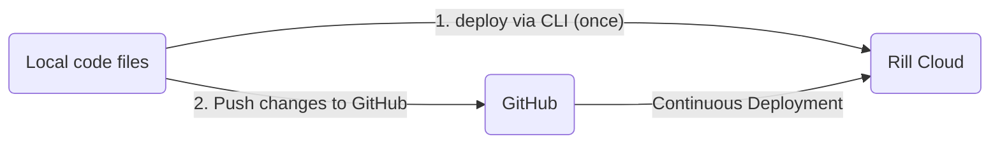

<!-- WARNING: There are links to this page in source code. If you move it, find and replace the links and consider adding a redirect in docusaurus.config.js. -->

## Overview

Deploying dashboards from Rill Developer allows you to share dashboards with other users, leverage [Rill Cloud capabilities](../../explore/dashboard-101), [embed Rill](/integrate/embedding.md) into other applications, and more!


The flow diagram below shows two options for deploying an existing project. 

**Deploy via the UI**: 

---
**Deploy via the CLI**:

    
## Deploying a project via the UI
Starting from **v0.48**, we have introduced the possibility to push dashboards _directly from Rill Developer's UI to Rill Cloud_. On the dashboard page, you can select the `deploy to share` button and follow the steps to deploy to Rill Cloud.


<br />

Now that you project has been deployed to Rill Cloud, you will need to ensure that your users have access! Please refer to the [user management](../../manage/user-management.md) section. After you have made updates to the dashboard and need to update it, you'll noticed that the button has changed to `redeploy`. Select this and we'll update the Rill Cloud project with your changes.


<br />

:::tip On an older version of Rill?

You can easily check the version of Rill that you are using in Rill Developer by running the following command:

```bash
rill --version
```

If you are on an older version of Rill, it is **strongly recommended** to [upgrade](home/install.md#upgrade-to-the-newest-version) to the latest version.

:::


## Deploying a project via the CLI
### Step 1 - Push the project to Rill Cloud via the CLI

When deploying to Rill Cloud via the CLI, you will have a choice to user a single upload or connect to a GitHub repository.

```
$rill deploy
    No git remote was found.
    You can connect to Github or use one-time uploads to deploy your project.
    ? Do you want to use one-time uploads? (Y/n) 
```

#### One-time uploads
If you select a one-time upload, we will deploy your project to your default organization without connecting a GitHub repository. You will have the option later, via the UI, to connect to a GitHub Repo if desired. Once connected to a repository, you will need to push changes directly to Github as the changes when selecting re-deploy will not push to your repository.


#### Syncing your GitHub Repository
In the case of deploying to Rill Cloud with a GitHub repository synced, you have two options:

##### Option 1 - Automated repository creation

If you'd like Rill Cloud to automaticaly create the Git repository for a Rill project that you deploy, you can skip to the [next step](#deploy-to-rill-cloud).

:::note GitHub app permissions

This assumes that the installed Github app in your organization has write access. If unsure, please check with your Github admin.

:::

##### Option 2 - Manual repository creation

If you'd like to create the Git repository manually, the project must be on Github <u>before</u> you deploy it to Rill.
- If your project is not yet on Github, you can follow the steps on Github [here](https://github.com/new) to create a new repository and push your project files to it.
- If your project is already on Github, make sure you have appropriate permissions to grant access to it. If you're deploying a project controlled by someone else, you may need to fork or copy it to a repository in your account.

:::info Custom Git repository name

When Rill attempts to create a Git repository on your behalf, _the new repository will mirror the name of your Rill project_. If you'd like more flexibility and/or to give the Git repository a different name, you should create the repository manually.

:::

#### Deploy to Rill Cloud

Finally, to deploy a project to Rill Cloud, from the local directory containing your Rill project, it's as simple as running the following command (after selecting `No` for the one-time upload option).

```
rill deploy
```

The CLI will guide you through authenticating with Rill Cloud and granting appropriate access to your Rill project on Github.

:::tip Configure credentials
Cloud datastores will typically require service keys to access data. Make sure to create the necessary key for your service account and then run ```rill env configure``` with the correct credentials. For more details, please refer to our [connector documentation](/build/credentials/credentials.md).

:::

#### First deployment

If this is your first deployment to Rill Cloud, you will get prompted to either sign up or log in (if you have an existing account on [Rill Cloud](https://ui.rilldata.com/)). Proceed with the sign up and email verification process for new users or authorization process for existing users. As a new user, you can expect to see the following page:


After successfully signing in and/or authorizing the Rill CLI, you will get prompted to connect to Github when deploying your project.


:::warning Select the correct Github organization when installing the Rill Cloud app

Make sure that you are selecting the correct Github organization when installing / connecting the Rill Cloud app. The organization should correspond to where you want your repositories to belong to when deploying Rill projects.

:::

After connecting Rill Cloud to Github and selecting a [default organization](/reference/cli/org) in the CLI, you should now be able to continuously deploy new projects and/or update existing projects. These projects, [unless specified otherwise](/reference/cli/deploy), will be deployed to your selected [organization](/manage/project-management.md).

:::info Check with your Github organization admin

If you're not the admin of your Github organization, they will likely need to first install the Rill Cloud app in your organization before you can proceed with deploying a project. After the Rill Cloud app is installed, it should have the following privileges:


:::

When deploying a project, Rill Cloud will first check whether there is a git remote present. If there is no git remote associated, Rill will automatically create a repository under your GitHub account. 

:::warning Beware of existing repositories with the same name!

Rill Cloud will automatically attempt to create a Git repository using the <u>same name</u> as your Rill project for auto-deployments. If a Git repository with the same name already exists, you should get prompted for a new name and receive a warning in the CLI.

:::

### Step 2 - Continue pushing changes to GitHub in order to update Rill Cloud
After making changes to your project in Rill Developer, you will need to [push your changes to GitHub](github-101.md#pushing-changes). Whether you decide to use a UI like GitHub Desktop or via the CLI using `git`, you will need to manage the objects to push to your repository.


## Continuous Deployment 
Rill should automatically detect changes that you have pushed locally to GitHub and update your deployed project accordingly. Depending on the changes, this may results in a project reconcile to occur. If you are experiencing some issues with the project after pushing changes to the CLI, please refer the the project's status page for more information or you can run via the CLI:

```
rill project status
```

:::tip Interested in using Gitlab?

Check out our documentation on deploying a [Rill project using Gitlab](deploy-from-ci.md)!

:::


## Change your production branch

By default, Rill deploys from the [default branch](https://docs.github.com/en/pull-requests/collaborating-with-pull-requests/proposing-changes-to-your-work-with-pull-requests/about-branches#about-the-default-branch) of your Git repository. You can change this to any branch you want.

To deploy your project from a different branch, run the following command:

```bash
rill deploy --prod-branch [PROD-BRANCH]
```


## Deploy from a monorepo

If your Rill project is in a sub-directory of a Git repository, use the `--subpath` option when creating your project:
```
rill deploy --subpath path/to/rill/project
```
:::warning
Note that you must run `rill deploy` from the <u>root</u> of your Git repository, **not** the root of your Rill project.
:::


