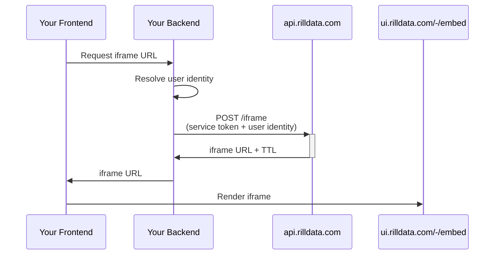

import Tabs from '@theme/Tabs';
import TabItem from '@theme/TabItem';

# Embed Dashboards

Embed Rill dashboards as iframes in your application. Three embedding modes are supported:

- **Single dashboard** — Embed one dashboard without navigation
- **Dashboard with navigation** — Embed a dashboard and allow users to navigate to other dashboards in the same project
- **Project listing** — Embed the dashboard list page with navigation between dashboards

## How It Works

Your backend uses a Rill service token to request a signed iframe URL from `api.rilldata.com`. The iframe URL is then passed to your frontend for rendering. Row-level security policies are enforced via the user identity embedded in the token.



## 1. Create a Service Token

```bash
rill service create <service_name> --org-role viewer

# Or scope to a specific project
rill service create <service_name> --project <project_name> --project-role viewer
```

See [Service Tokens](/guide/administration/access-tokens/service-tokens) for roles, attributes, and management. See the [CLI reference](/reference/cli/service) for full command options.

:::caution
Service tokens have broad permissions. Never expose them in frontend code.
:::

## 2. Build the Iframe URL (Backend)

Your backend calls `POST /v1/organizations/<org>/projects/<project>/iframe` with the service token to get a signed iframe URL.

<Tabs>
  <TabItem value="curl" label="Curl" default>

```bash
curl -X POST 'https://api.rilldata.com/v1/organizations/<org-name>/projects/<project-name>/iframe' \
  -H 'Content-Type: application/json' \
  -H 'Authorization: Bearer <rill-svc-token>' \
  -d '{
    "resource": "<explore-name>",
    "type": "explore",
    "user_email": "<user-email>"
  }'
```

  </TabItem>
  <TabItem value="js" label="JavaScript">

```js
const express = require("express");
const app = express();
app.use(express.json());

const RILL_TOKEN = "<YOUR RILL SERVICE TOKEN>";
const RILL_ORG = "<YOUR RILL ORG NAME>";
const RILL_PROJECT = "<YOUR RILL PROJECT NAME>";

app.post("/api/rill/iframe", async (req, res) => {
  try {
    const response = await fetch(
      `https://api.rilldata.com/v1/organizations/${RILL_ORG}/projects/${RILL_PROJECT}/iframe`,
      {
        method: "POST",
        headers: {
          "Content-Type": "application/json",
          Authorization: `Bearer ${RILL_TOKEN}`,
        },
        body: JSON.stringify({
          resource: req.body.resource,
          // user_email: "<user-email>",
          // theme: "my-custom-theme",
          // theme_mode: "dark",
        }),
      },
    );
    const data = await response.json();
    if (!response.ok) throw new Error(data.message);
    res.json(data);
  } catch (error) {
    res.status(500).json({ error: error.message });
  }
});

app.listen(3000);
```

  </TabItem>
  <TabItem value="python" label="Python">

```python
from flask import Flask, request, jsonify
import requests

app = Flask(__name__)

@app.route("/api/rill/iframe", methods=["POST"])
def get_rill_iframe():
    try:
        response = requests.post(
            "https://api.rilldata.com/v1/organizations/<org-name>/projects/<project-name>/iframe",
            headers={
                "Content-Type": "application/json",
                "Authorization": "Bearer <rill-svc-token>",
            },
            json={
                "resource": request.json.get("resource"),
                "type": "explore",
                "user_email": "<user-email>",
                # "theme": "my-custom-theme",
                # "theme_mode": "dark",
            },
        )
        response.raise_for_status()
        return jsonify(response.json())
    except requests.RequestException as e:
        return jsonify(error=str(e)), 500

if __name__ == "__main__":
    app.run(port=3000)
```

  </TabItem>
  <TabItem value="go" label="Go">

```go
package main

import (
	"bytes"
	"encoding/json"
	"fmt"
	"io"
	"net/http"
)

func getRillIframe(w http.ResponseWriter, r *http.Request) {
	var reqBody map[string]string
	json.NewDecoder(r.Body).Decode(&reqBody)

	body, _ := json.Marshal(map[string]string{
		"resource":   reqBody["resource"],
		"type":       "explore",
		"user_email": "<user-email>",
	})

	resp, err := http.Post(
		"https://api.rilldata.com/v1/organizations/<org-name>/projects/<project-name>/iframe",
		"application/json",
		bytes.NewBuffer(body),
	)
	if err != nil {
		http.Error(w, err.Error(), http.StatusInternalServerError)
		return
	}
	defer resp.Body.Close()

	w.Header().Set("Content-Type", "application/json")
	io.Copy(w, resp.Body)
}

func main() {
	http.HandleFunc("/api/rill/iframe", getRillIframe)
	fmt.Println("Server started at :3000")
	http.ListenAndServe(":3000", nil)
}
```

  </TabItem>
  <TabItem value="java" label="Java">

```java
import org.springframework.web.bind.annotation.*;
import org.springframework.web.client.RestTemplate;
import org.springframework.http.*;
import java.util.Map;

@RestController
public class DashboardController {

    @PostMapping("/api/rill/iframe")
    public ResponseEntity<?> getRillIframe(@RequestBody Map<String, Object> payload) {
        HttpHeaders headers = new HttpHeaders();
        headers.set("Content-Type", "application/json");
        headers.set("Authorization", "Bearer <rill-svc-token>");

        Map<String, Object> body = Map.of(
            "resource", payload.get("resource"),
            "type", "explore",
            "user_email", "<user-email>"
        );

        RestTemplate rest = new RestTemplate();
        ResponseEntity<Map> response = rest.postForEntity(
            "https://api.rilldata.com/v1/organizations/<org-name>/projects/<project-name>/iframe",
            new HttpEntity<>(body, headers),
            Map.class
        );
        return ResponseEntity.ok(response.getBody());
    }
}
```

  </TabItem>
</Tabs>

### API Parameters

| Parameter | Type | Required | Description |
|---|---|---|---|
| `resource` | string | No | Dashboard name. Omit when using `navigation: true` to embed the project listing. |
| `type` | string | No | `explore` (default) or `canvas` |
| `navigation` | boolean | No | Allow navigation between dashboards. Default `false`. |
| `theme` | string | No | Named [theme](/developers/build/dashboards/customization#changing-themes--colors) to apply |
| `theme_mode` | string | No | `light` (default), `dark`, or `system` |
| `user_id` | string | No | User ID for row-level security |
| `user_email` | string | No | User email for row-level security |
| `attributes` | object | No | Custom attributes for security policies (e.g., `tenantId`, `domain`) |
| `ttl_seconds` | integer | No | Token TTL. Default `86400` (24h). |

:::info Only pass one identity field
Use **one of** `user_id`, `user_email`, or `attributes` — not multiple.
:::

### Embedding Modes

```js
// Single dashboard (no navigation)
{ resource: "dashboard-name" }

// Dashboard with navigation enabled
{ resource: "dashboard-name", navigation: true }

// Project listing (no specific dashboard)
{ navigation: true }
```

### Response

```json
{
  "iframeSrc": "https://ui.rilldata.com/-/embed?access_token=<token>&instance_id=<id>&resource=<name>&runtime_host=<host>&theme_mode=dark",
  "runtimeHost": "<host>",
  "instanceId": "<id>",
  "accessToken": "<token>",
  "ttlSeconds": 86400
}
```

The `iframeSrc` is valid for `ttlSeconds`. After expiry, request a new URL.

## 3. Render the Iframe (Frontend)

```html
<iframe title="rill-dashboard" src="<iframeSrc>" width="100%" height="100%" />
```

### React Example

```jsx
import { useEffect, useState } from "react";

export default function RillDashboard() {
  const [iframeSrc, setIframeSrc] = useState("");
  const [error, setError] = useState("");

  useEffect(() => {
    fetch("/api/rill/iframe", {
      method: "POST",
      headers: { "Content-Type": "application/json" },
      body: JSON.stringify({ resource: "my-dashboard" }),
    })
      .then((res) => res.json())
      .then((data) => (data.error ? setError(data.error) : setIframeSrc(data.iframeSrc)))
      .catch((err) => setError(err.message));
  }, []);

  if (error) return <p>Error: {error}</p>;
  if (!iframeSrc) return <p>Loading...</p>;
  return <iframe title="rill-dashboard" src={iframeSrc} width="100%" height="1000" />;
}
```

For a complete Next.js example, see the [rill-embedding-example](https://github.com/rilldata/rill-embedding-example) repo.

## Testing with Mock Users

Use [Rill Developer's mock users](/developers/build/metrics-view/security#advanced-example-custom-attributes-embed-dashboards) to test row-level security locally before deploying:

```yaml
- email: embed@rilldata.com
  name: embed
  custom_variable_1: Value_1
  custom_variable_2: Value_2
```

## See Also

- [Iframe API](/developers/embed/iframe-api) — Control embedded dashboards programmatically
- [URL Parameters](/reference/url-syntax/url-parameters) — Dashboard state query parameters
- [Row Access Policies](/developers/build/metrics-view/security) — Security policies for embedded dashboards
