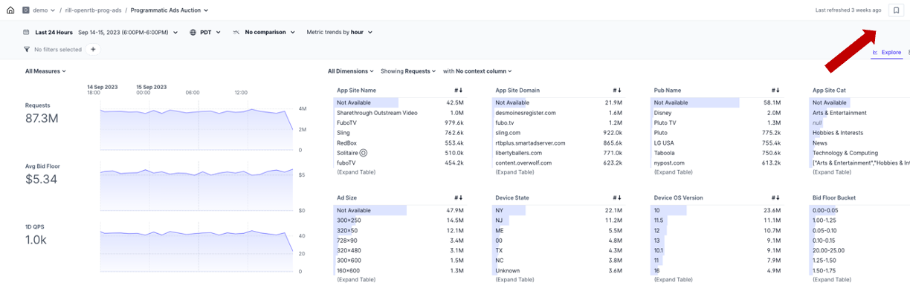
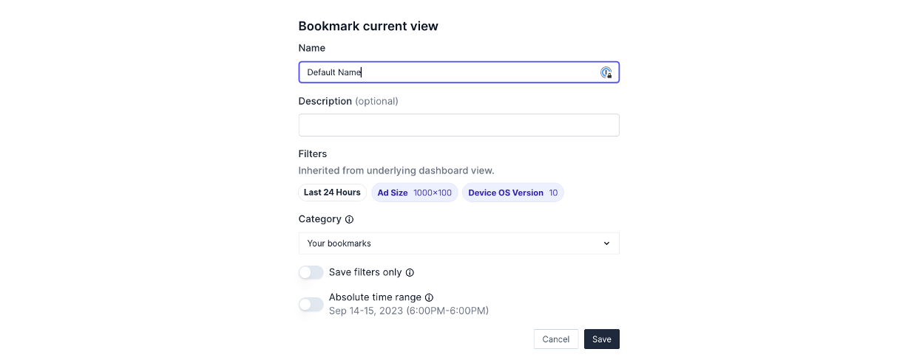

## Overview

Bookmarks are useful to return to regular analyses and filter sets commonly used for reporting or deep dives. If you have a regular view of the data, a bookmark is also a good replacement rather than creating an entirely new dashboard as it contains a subset of the view while retaining all of the fields available for analysis.

Common use cases for Bookmarks include:
- Weekly/Monthly reporting
- Setting filters for specific users/use cases (eg. teams or executives with a narrower view, an account manager's book of clietns)
- Answering common troubleshooting questions by starting with a subset of problem dimensions

## How to set and use Bookmarks

On the top right portion of the screen, you will see the Bookmark icon to bring up the option to save a bookmark. Clicking that icon brings up options to save the current page as your homescreen, create a new bookmark page, or to see your list of bookmarks (and shared bookmarks).

On the bookmark screen, you'll then be able to set the options related to the saved view:

- **Name:** Set a name and description (_optional_)
- **Filters:** All filters from your previous analysis will be carried into the bookmark. Add/remove any additional filters as necessary
- **Shared or Local:** Select a category (_for admins who wish to make a public bookmark_)
- **Save Filters Only:** this option will save only the filter combination to be re-used later without restricting the measures and dimensions
- **Absolute Dates:** use this option if you have a saved time period and return exactly to that period versus using the time period filter  

