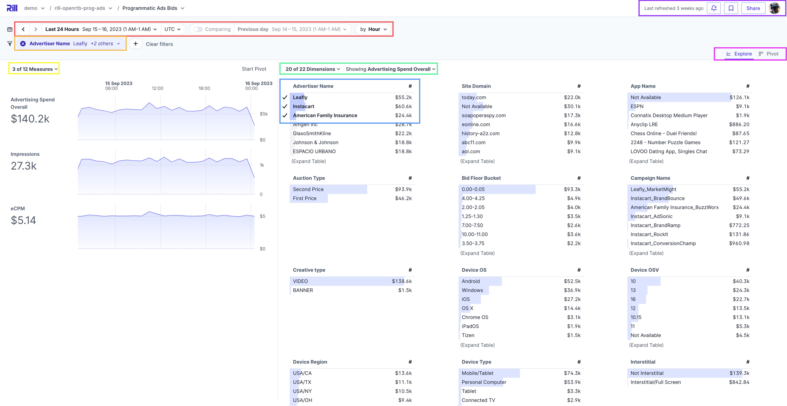

## Overview

When you first log in to Rill, you'll see all of the projects available to your user. Within those projects, you'll then be able to access individual dashboards. This quickstart will call out basic navigation and a few key features. The Explore section of our docs contains more detail on the many ways you can slice and dice data within Rill. 

## Quickstart

The main screen of Rill (called Explore) is laid out with all metrics on the left hand side, broken out with a summary number and time series, and all dimensions on the right in leaderboards. You can add or remove any metric or dimension from the page by selecting them from the dropdown above the charts (#1). You can drill into leaderboards further (#2) to see all metrics for a dimension. Within that drilldown, you can also sort by metric, search your dimensions, or [export data](exports.md). 

At the top of the screen, you can change the period of analysis (#3). You can select from a pre-defined period (like last week) or choose a custom date range. Next to the time selector, you can set comparisons to analyze the prior period or to compare dimensions. Underneath the time selector, you'll find your filter bar (#4) where you can [add filters](filters/filters.md) for metrics (e.g. all campaigns with more than 1000 impressions) or for dimensions (e.g. campaign_name = Instacart like the image). You can also filter by clicking any row in a leaderboard as the dashboard is interactive. 

Finally, you can also customize the view #5 to a set of metrics, dimensions and filters as saved view - what Rill calls [a Bookmark](bookmarks.md). Bookmarks allow you to come back to your mostly commonly used pages - keeping one overall dashboard view, but saving your most common analyses. Next to bookmarks, you can also click share to send a direct link to any analysis.

There are additional capabilities and more detail on how to use each of the above in the pages listed at the bottom of the page.

## More Details

- **[Filters & Comparisons](filters/filters.md)**
- **[Bookmarks & Sharing](bookmarks.md)**
- **[Exports](exports.md)**
- **[Alerts](alerts.md)**