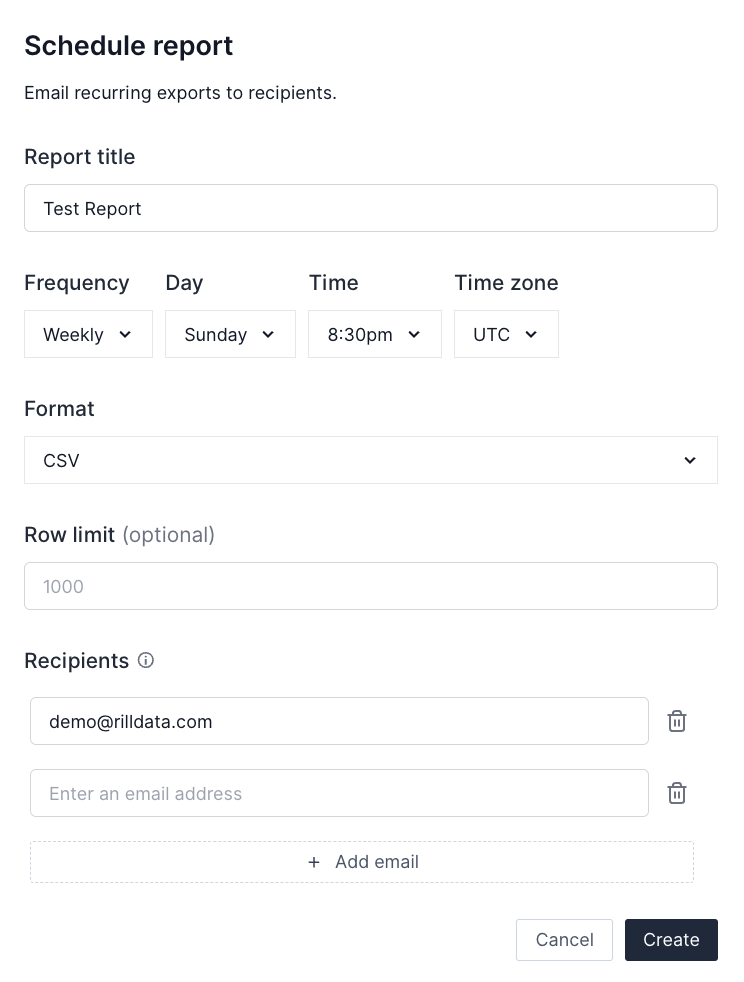

## Overview 
Rill provides the ability to export data from multiple locations - leaderboards, Time Dimension detail and Pivot Tables (_coming soon_). In addition to direct downloads, you can also set up recurrning reports to your inbox. Scheduled Reports allow you to effortlessly generate and manage email reports for any exportable content within your Rill cloud dashboard. 

- [Exporting from Rill](#exporting-from-rill)
- [How to Schedule an Email Report](#how-to-schedule-an-email-report)
- [Managing Scheduled Reports](#managing-scheduled-reports)

### Exporting from Rill

There are several places to export your data from Rill. In each case, you will see options for exporting to csv, xlsx or parquet formats. 

Exports are available from:

- Leaderboards: expand a leaderboard in Explore and select Export on the top right
- Time Dimension Detail: after choosing a comparison, select Export on the time series chart
- Pivot Tables: _coming soon_ 

### How to Schedule an Email Report

Follow these simple steps to schedule an email report:

1. **Navigate to Content:** Expand a dimension table by clicking on the dimension name.

2. **Export Options:** Click on the Export button and select "Create scheduled report..." Filters, comparisons, and sort orders will be preserved for your report.

3. **Configure Report Settings:** Choose a frequency and set a time to receive the output. Choose a report format (csv/excel/parquet) and specify a list of recipients.

4. **Complete and Enjoy:** Click "Done." User-created reports will be delivered directly to your inbox 🎉.

### Managing Scheduled Reports

Reports are managed from your homescreen. To navigate to the report admin page, select the Home button on the top left and the Reports tab from your homepage.

- **Accessing Reports:** When browsing projects, find related assets for each project, including dashboards, reports, and logs.

- **Permissions:** Viewers can see their own reports, while administrators can view both their own and other users' reports.

- **Report Details:** Click into a report to view schedule details, next run information, recipients, and execution history.

- **Deletion:** To delete a report, click the three-dot menu next to the report name and select "Delete Report."

- **Unsubscribe Option:** Recipients have the option to unsubscribe by clicking the provided link within the report delivery email.

