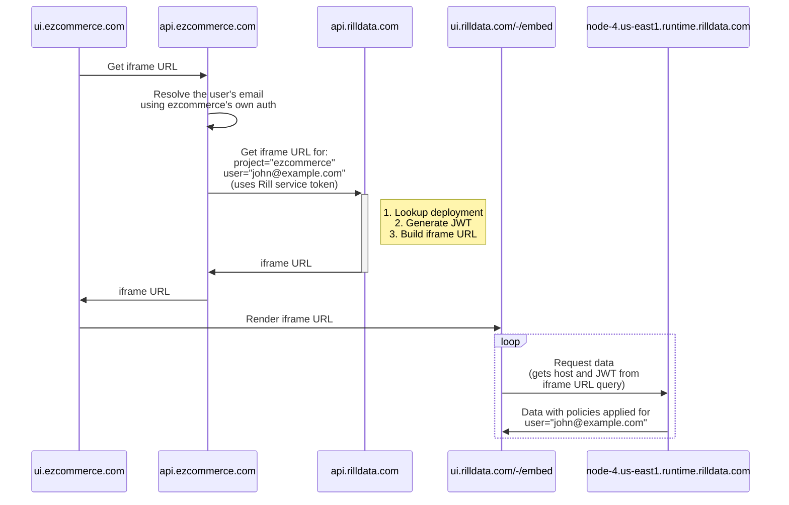

import Tabs from '@theme/Tabs';
import TabItem from '@theme/TabItem';

## Embedding dashboards

### Introduction

Rill Cloud provides the ability to embed dashboards as components in your own application using iframes, with a few different options:
- Embedding individual dashboards as standalone iframes
- Embedding individual dashboards with the ability to navigate to other dashboards (that exist in the _same_ project)
- Embedding the dashboard list page present in a Rill project (with the ability to select and navigate between dashboards)

When embedding Rill, you need to generate a service token for your backend to request an authenticated iframe URL via the Rill APIs. Afterwards, the iframe URL can be passed to your frontend application for rendering. Here's a high-level diagram of what this flow looks like:



### Create a service token
Use the Rill CLI to create a service token for your current organization using the following command:
```bash
# Create with organization role
rill service create <service_name> --org-role viewer

# Or create with project-specific role
rill service create <service_name> --project <project_name> --project-role viewer
```

:::info
For comprehensive documentation on service tokens, including roles, custom attributes, and management, see [Service Tokens](/manage/service-tokens). Also see the [CLI reference](../reference/cli/service) for command details.
:::

:::caution
Service tokens can have broad permissions and should be handled confidentially. Therefore, the service token itself should **not** be integrated directly in frontend or other user-facing code that can be exposed publicly.
:::

### Backend: Build an iframe URL
You should implement an API on your backend that uses the service token to retrieve and return an iframe URL from Rill's API (which is hosted on `api.rilldata.com`).

There are multiple reasons why the iframe URL <u>must</u> be constructed on your backend:
- To avoid leaking your master Rill service token in the browser
- To allow you to use your own authentication and authorization logic to restrict access to the dashboard
- To optionally use your backend's context about the authenticated user to include user attributes in the iframe URL for enforcement of row-level security policies

Here are examples of how to get an iframe URL using different languages:

<Tabs>
  <TabItem value="curl" label="Curl" default>

```bash
curl -X POST --location 'https://api.rilldata.com/v1/organizations/<org-name>/projects/<project-name>/iframe' \
--header 'Content-Type: application/json' \
--header 'Authorization: Bearer <rill-svc-token>' \
--data-raw '{
"resource": "<explore-name>",
"type": "explore",
"user_email": "<user-email>"
}'
```
  </TabItem>
  <TabItem value="js" label="Javascript">
    JavaScript (Node.js) with Express.js

```js
const express = require('express');
const fetch = require('node-fetch');

const rillServiceToken = "<YOUR RILL SERVICE TOKEN>";
const rillOrg = "<YOUR RILL ORG NAME>";
const rillProject = "<YOUR RILL PROJECT NAME>";

const app = express();
app.use(express.json());
app.post('/api/rill/iframe', async (req, res) => {
  const dashboardName = req.body.resource;
  try {
    const response = await fetch(`https://api.rilldata.com/v1/organizations/${rillOrg}/projects/${rillProject}/iframe`, {
      method: 'POST',
      headers: {
        'Content-Type': 'application/json',
        Authorization: `Bearer ${rillServiceToken}`,
      },
      body: JSON.stringify({
        resource: dashboardName,
        // Optionally include the current user's email address for row-level security enforcement:
        // user_email: '<CURRENT USER'S EMAIL ADDRES>',
      }),
    });
    const data = await response.json();
    if (response.ok) {
      res.json(data);
    } else {
      throw new Error(data.message);
    }
  } catch (error) {
    res.status(500).json({ error: error.message });
  }
});

const PORT = 3000;
app.listen(PORT, () => {
  console.log(`Server running on port ${PORT}`);
});
```

  </TabItem>
  <TabItem value="python" label="Python">
    Python with Flask

```python
from flask import Flask, request, jsonify
import requests

app = Flask(__name__)

@app.route('/api/rill/iframe', methods=['POST'])
def get_rill_iframe():
    dashboard_name = request.json.get('resource')
    try:
        response = requests.post(
            'https://api.rilldata.com/v1/organizations/<org-name>/projects/<project-name>/iframe',
            headers={
                'Content-Type': 'application/json',
                'Authorization': 'Bearer <rill-svc-token>',
            },
            json={
                'resource': dashboard_name,
                'type': 'explore',
                'user_email': '<user-email>',
            }
        )
        response.raise_for_status()
        data = response.json()
        return jsonify(data)
    except requests.RequestException as e:
        return jsonify(error=str(e)), 500

if __name__ == '__main__':
    app.run(port=3000)

```
  </TabItem>
  <TabItem value="go" label="Go">
    Go with net/http

```go
package main

import (
	"bytes"
	"encoding/json"
	"fmt"
	"io/ioutil"
	"net/http"
)

func getRillIframe(w http.ResponseWriter, r *http.Request) {
	var reqBody map[string]string
	json.NewDecoder(r.Body).Decode(&reqBody)
	dashboardName := reqBody["resource"]

	requestBody, err := json.Marshal(map[string]string{
		"resource": dashboardName,
		"type": "explore",
		"user_email": "<user-email>",
	})

	if err != nil {
		http.Error(w, err.Error(), http.StatusInternalServerError)
		return
	}

	resp, err := http.Post("https://api.rilldata.com/v1/organizations/<org-name>/projects/<project-name>/iframe", "application/json", bytes.NewBuffer(requestBody))
	if err != nil {
		http.Error(w, err.Error(), http.StatusInternalServerError)
		return
	}
	defer resp.Body.Close()

	body, err := ioutil.ReadAll(resp.Body)
	if err != nil {
		http.Error(w, err.Error(), http.StatusInternalServerError)
		return
	}

	var respBody map[string]any
	err = json.Unmarshal(body, &respBody)
  if err != nil {
		http.Error(w, err.Error(), http.StatusInternalServerError)
		return
	}
  
	w.Header().Set("Content-Type", "application/json")
	err = json.NewEncoder(w).Encode(respBody)
  if err != nil {
		http.Error(w, err.Error(), http.StatusInternalServerError)
		return
	}
}

func main() {
	http.HandleFunc("api/rill/iframe", getRillIframe)
	fmt.Println("Server started at port 3000")
	http.ListenAndServe(":3000", nil)
}
```
  </TabItem>

  <TabItem value="java" label="Java">
    Java With Spring Boot 

```java
import org.springframework.web.bind.annotation.PostMapping;
import org.springframework.web.bind.annotation.RequestBody;
import org.springframework.web.bind.annotation.RestController;
import org.springframework.web.client.RestTemplate;
import org.springframework.http.ResponseEntity;
import org.springframework.http.HttpEntity;
import org.springframework.http.HttpHeaders;
import java.util.Map;

@RestController
public class DashboardController {

    @PostMapping("/api/rill/iframe")
    public ResponseEntity<?> getRillIframe(@RequestBody Map<String, Object> payload) {
        String dashboardName = (String) payload.get("resource");
        HttpHeaders headers = new HttpHeaders();
        headers.set("Content-Type", "application/json");
        headers.set("Authorization", "Bearer <rill-svc-token>");

        Map<String, Object> request = Map.of(
                "resource", dashboardName,
                "type", "explore",
                "user_email", "<user-email>"
        );

        HttpEntity<Map<String, Object>> entity = new HttpEntity<>(request, headers);
        RestTemplate restTemplate = new RestTemplate();
        ResponseEntity<Map> response = restTemplate.postForEntity("https://api.rilldata.com/v1/organizations/<org-name>/projects/<project-name>/iframe", entity, Map.class);

        Map<String, Object> resp = (Map<String, Object>) response.getBody().get("resp");
        Map<String, String> responseBody = Map.of("iframeResp", (String) ((Map<String, Object>) resp.get("body")));

        return ResponseEntity.ok(responseBody);
    }
}
```
  </TabItem>

</Tabs>


The API accepts the following parameters:

| Parameter   | Description                                                                                                                                                                                                                                                                                              | Required                                                                      |
| ----------- | -------------------------------------------------------------------------------------------------------------------------------------------------------------------------------------------------------------------------------------------------------------------------------------------------------- | ----------------------------------------------------------------------------- |
| resource    | The name of the dashboard to embed                                                                                                                                                                                                                                                                       | No (if not specified, `navigation` should be set to `true`)                   |
| type        | The type of the dashboard identified by `resource` (options: `explore`, `canvas`)                                                                                                                                                                                                                        | No (defaults to `explore`)                                                    |
| navigation  | Boolean whether to enable navigation and allow users to navigate to other dashboards (`false` will hard embed and allow access to a single dashboard; `true` allows navigation)                                                                                                                          | No (defaults to `false`)                                                      |
| theme       | If [themes](/build/dashboards/customization#changing-themes--colors) are being used, the specific theme to pass to the embedded dashboard                                                                                                                                                                | No (set to the name of the theme)                                             |
| user_id     | The id of the user to embed the dashboard for                                                                                                                                                                                                                                                            | No (only one of `user_id`, `user_email`, or `attributes` should be passed in) |
| user_email  | The email of the user to embed the dashboard for                                                                                                                                                                                                                                                         | No (only one of `user_id`, `user_email`, or `attributes` should be passed in) |
| attributes  | Json payload to be put in the access token, used to pass attributes to the dashboard for enforcing policies. When using this make sure to pass all the attributes used in your security policy like `email`, `domain` and `admin` and any other custom attributes such as `tenantId`, `customerId`, etc. | No (It is also possible to add custom attributes here)                        |
| ttl_seconds | The time to live for the iframe URL                                                                                                                                                                                                                                                                      | No (Default: 86400)                                                           |

:::tip Embedding the project vs embedding an individual dashboard

One of the most common differences between how developers may wish to iframe Rill is whether they wish to embed at the project level or individual dashboard level. This behavior can be controlled through the combination of the `resource` and `navigation` properties!

If you wish to embed a single dashboard **only**, your payload might look like:
```json
{
  // simply provide a resource
  resource: 'dashboardName'
}
```

If you wish to still embed a dashboard _but allow navigation between dashboards_, then your payload should include both parameters:
```json
{
  // enable navigation and provide a resource
    resource: 'dashboardName',
    navigation: true
}
```

Finally, _if you wish to embed the project list view of dashboards instead (what you see when you first open a project in Rill Cloud)_, then you can simply omit the `resource` and appropriately set `navigation` in your payload:
```json
{
  // enable navigation and do NOT provide a resource
  navigation: true
}
```

:::

The response of the above POST request will then contain an `iframeSrc` value that can be used to embed the dashboard or set of dashboards in your application. It will also contain a `ttlSeconds` value, which indicates how long the iframe URL will be valid for. _After the TTL has elapsed_, the iframe URL needs to be refreshed as the underlying access token being used will no longer be valid (for security purposes). Here's an example response:

```json
{
  "iframeSrc": "https://ui.rilldata.com/-/embed?access_token=<token>&instance_id=<id>&kind=MetricsView&resource=<dashboard-name>&runtime_host=<runtime_host>&state=&theme=",
  "runtimeHost": "<runtime_host>",
  "instanceId": "<id>",
  "accessToken": "<token>",
  "ttlSeconds": 86400
}
```

### Testing the dashboard

While it is possible to create the iframeSrc URL via the CLI or code to _test_ your embedded dashboard, it might be easier to start off using [Rill Developer's mock users](/build/metrics-view/security#advanced-example-custom-attributes-embed-dashboards), especially if you have multiple attribute views that you want to test before deploying to Rill Cloud. You can pass specific custom_attributes as you would during iframe URL generation to view the pre-filtered explore dashboard. 

```yaml
- email: embed@rilldata.com
  name: embed
  custom_variable_1: Value_1
  custom_variable_2: Value_2
```


### Frontend: Embed the dashboard
Your frontend should request an iframe URL from your backend API (which you set up in the previous step) and use the `iframeSrc` value of the response to render an HTML `<iframe>` element:
```html
<iframe title="rill-dashboard" src="<iframeSrc>" width="100%" height="100%" />
```

## Appendix

### React Example

Depending on how your app is written and the language being used, you can then use the resulting iframe URL to embed and display Rill dashboards accordingly. Below is a basic example of how to fetch and render a dashboard in **React**:

```jsx
import React, { useEffect, useState } from 'react';

export default function RillDashboard() {
  const [isLoading, setLoading] = useState(true);
  const [iframeSrc, setIframeSrc] = useState('');
  const [error, setError] = useState('');

  useEffect(() => {
    fetch(`<YOUR BACKEND HOST>/api/rill/iframe`, {
      method: 'GET',
      headers: {
        'Content-Type': 'application/json',
      },
    })
    .then((response) => response.json())
    .then(({ iframeSrc, error }) => {
      if (error !== undefined) {
        setError(error);
      } else {
        setIframeSrc(iframeSrc);
      }
      setLoading(false);
    })
    .catch((err) => {
      setError(err.message);
      setLoading(false);
    });
  }, []);

  if (isLoading) return <p>Loading...</p>;
  if (error) return <p>Failed with error: {error}</p>;

  return (
    <iframe title="rill-dashboard"
      src={iframeSrc}
      width="100%"
      height="1000"
    />
  );
};
```

### Next.js Example

You can find a different end-to-end example of embedding a Rill dashboard in a **Next.js** project in this sample [GitHub repo](https://github.com/rilldata/rill-embedding-example).
