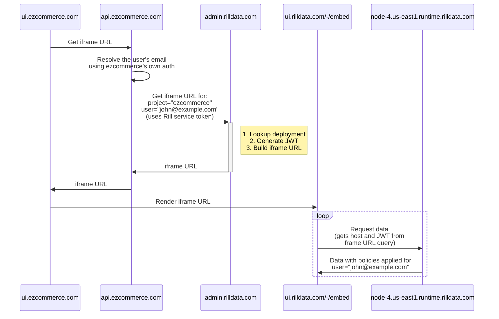

## Embedding dashboards

### Introduction
You can embed Rill dashboards in your own applications using iframe. This allows you to use Rill dashboards as a component.

To embed a dashboard, the customer's backend needs to use a Rill service token to request an authenticated iframe URL from `admin.rilldata.com`. 
The iframe URL is then used to embed the dashboard in the customer's application. Here is a diagram of the flow:



### Create a service token
Use rill cli to create a service token for your organization. You can create a new service account along with token for your organization using the following command:

```bash

rill service create <service_name> [--org "My Organization"]
```

To issue service token for an existing service account, use the following command:

```bash
rill service token issue <service_name> [--org "My Organization"]
```

See the reference docs for more details on managing [service account and token](../reference/cli/service).

### Backend: Build an iframe URL
The backend needs to use the service token to request an iframe URL from `admin.rilldata.com`. The iframe URL is then used to embed the dashboard in the customer's application.
Here's a minimal example POST call to `admin.rilldata.com` to get an iframe URL:

```bash

curl -X POST --location 'https://admin.rilldata.com/v1/organizations/<org-name>/projects/<project-name>/iframe' \
--header 'Content-Type: application/json' \
--header 'Authorization: Bearer <rill-svc-token>' \
--data-raw '{
    "resource": "<dashboard-name>",
    "user_email":"<user-email>"
}'
```

The API accepts the following parameters:

| Parameter | Description                                      | Required           |
| --- |--------------------------------------------------|--------------------|
| resource | The name of the dashboard to embed               | Yes                |
| user_email | The email of the user to embed the dashboard for | Yes                |
| ttl_seconds | The time to live for the iframe URL             | No (Default: 86400) |


The response will contain an iframe URL that can be used to embed the dashboard in the customer's application. Here's an example response:

```json
{
  "iframeSrc": "https://ui.rilldata.com/-/embed?access_token=<token>&instance_id=<id>&kind=MetricsView&resource=<dashboard-name>&runtime_host=<runtime_host>&state=&theme=",
  "runtimeHost": "<runtime_host>",
  "instanceId": "<id>",
  "accessToken": "<token>",
  "ttlSeconds": 86400
}
```

### Frontend: Embed the dashboard
The frontend just need to use the iframeSrc to embed the dashboard in the customer's application. Here's an example of how to embed the dashboard using iframe:

```html
<iframe title="rill-dashboard" src="<iframeSrc>" width="100%" height="1000" style="border:0;" />
```

### Example
Here's an example of how to create a dashboard component in a React application:

```jsx
import React, { useEffect, useState } from 'react';
import { useUser } from '../hooks/useUser';

const RillDashboard = () => {
  const [iframeUrl, setIframeUrl] = useState('');
  const { userEmail } = useUser();

  useEffect(() => {
      const getIframeUrl = async () => {
      const response = await fetch(
        `https://admin.rilldata.com/v1/organizations/<org-name>/projects/<project-name>/iframe`,
        {
          method: 'POST',
          headers: {
            'Content-Type': 'application/json',
            Authorization: `Bearer <rill-svc-token>`,
          },
          body: JSON.stringify({
            resource: '<dashboard-name>',
            user_email: userEmail,
          }),
        }
      );
      const resp = await response.json();
      setIframeUrl(resp.iframeSrc);
    };
    getIframeUrl();
  }, [userEmail]);

  return (
    <iframe title="rill-dashboard"
      src={iframeUrl}
      width="100%"
      height="1000" 
      style="border:0;"
    />
  );
};

export default Dashboard;
```
