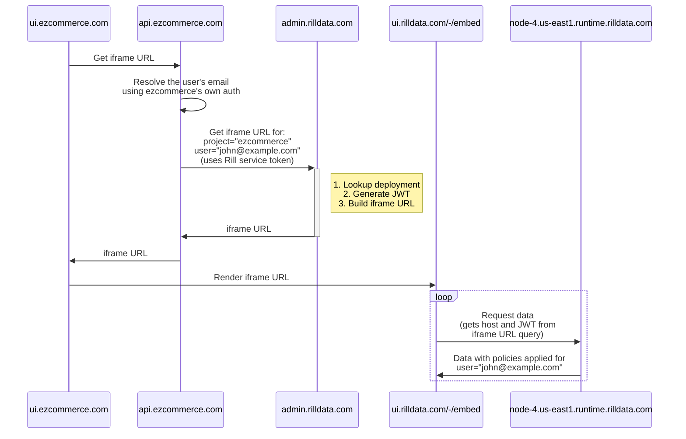

import Tabs from '@theme/Tabs';
import TabItem from '@theme/TabItem';

## Embedding dashboards

### Introduction
You can embed Rill dashboards as components in your own application using iframes.

To embed a dashboard, use a Rill service token on your backend to request an authenticated iframe URL from the Rill API.
Then pass the iframe URL to your frontend for rendering. Here is a diagram of the flow:



### Create a service token
Use the Rill CLI to create a service token for your current organization using the following command:
```bash
rill service create <service_name>
```

:::caution
The service account provides admin-level access to your organization and should be handled confidentially and NOT integrated in a frontend or other user-facing code.
:::

See the reference docs for more details on managing [service account and token](../reference/cli/service).

### Backend: Build an iframe URL
You should implement an API on your backend that uses the service token to retrieve and return an iframe URL from Rill's API (which is hosted on `admin.rilldata.com`).

There are multiple reasons why the iframe URL must be constructed on your backend:
- To avoid leaking your master Rill service token in the browser
- To allow you to use your own authentication and authorization logic to restrict access to the dashboard
- To optionally allow you to use your backend's context about the authenticated user to include user attributes in the iframe URL for enforcement of row-level security policies

Here are examples of how to get an iframe URL using different languages:

<Tabs>
  <TabItem value="curl" label="Curl" default>

```bash
curl -X POST --location 'https://admin.rilldata.com/v1/organizations/<org-name>/projects/<project-name>/iframe' \
--header 'Content-Type: application/json' \
--header 'Authorization: Bearer <rill-svc-token>' \
--data-raw '{
"resource": "<dashboard-name>",
"user_email":"<user-email>"
}'
```
  </TabItem>
  <TabItem value="js" label="Javascript">
    JavaScript (Node.js) with Express.js

```js
const express = require('express');
const fetch = require('node-fetch');

const rillServiceToken = "<YOUR RILL SERVICE TOKEN>";
const rillOrg = "<YOUR RILL ORG NAME>";
const rillProject = "<YOUR RILL PROJECT NAME>";

const app = express();
app.use(express.json());
app.post('/api/rill/iframe', async (req, res) => {
  const dashboardName = req.body.resource;
  try {
    const response = await fetch(`https://admin.rilldata.com/v1/organizations/${rillOrg}/projects/${rillProject}/iframe`, {
      method: 'POST',
      headers: {
        'Content-Type': 'application/json',
        Authorization: `Bearer ${rillServiceToken}`,
      },
      body: JSON.stringify({
        resource: dashboardName,
        // Optionally include the current user's email address for row-level security enforcement:
        // user_email: '<CURRENT USER'S EMAIL ADDRES>',
      }),
    });
    const data = await response.json();
    if (response.ok) {
      res.json(data);
    } else {
      throw new Error(data.message);
    }
  } catch (error) {
    res.status(500).json({ error: error.message });
  }
});

const PORT = 3000;
app.listen(PORT, () => {
  console.log(`Server running on port ${PORT}`);
});
```

  </TabItem>
  <TabItem value="python" label="Python">
    Python with Flask

```python
from flask import Flask, request, jsonify
import requests

app = Flask(__name__)

@app.route('/api/rill/iframe', methods=['POST'])
def get_rill_iframe():
    dashboard_name = request.json.get('resource')
    try:
        response = requests.post(
            'https://admin.rilldata.com/v1/organizations/<org-name>/projects/<project-name>/iframe',
            headers={
                'Content-Type': 'application/json',
                'Authorization': 'Bearer <rill-svc-token>',
            },
            json={
                'resource': dashboard_name,
                'user_email': '<user-email>',
            }
        )
        response.raise_for_status()
        data = response.json()
        return jsonify(data)
    except requests.RequestException as e:
        return jsonify(error=str(e)), 500

if __name__ == '__main__':
    app.run(port=3000)

```
  </TabItem>
  <TabItem value="go" label="Go">
    Go with net/http

```go
package main

import (
	"bytes"
	"encoding/json"
	"fmt"
	"io/ioutil"
	"net/http"
)

func getRillIframe(w http.ResponseWriter, r *http.Request) {
	var reqBody map[string]string
	json.NewDecoder(r.Body).Decode(&reqBody)
	dashboardName := reqBody["resource"]

	requestBody, err := json.Marshal(map[string]string{
		"resource":   dashboardName,
		"user_email": "<user-email>",
	})

	if err != nil {
		http.Error(w, err.Error(), http.StatusInternalServerError)
		return
	}

	resp, err := http.Post("https://admin.rilldata.com/v1/organizations/<org-name>/projects/<project-name>/iframe", "application/json", bytes.NewBuffer(requestBody))
	if err != nil {
		http.Error(w, err.Error(), http.StatusInternalServerError)
		return
	}
	defer resp.Body.Close()

	body, err := ioutil.ReadAll(resp.Body)
	if err != nil {
		http.Error(w, err.Error(), http.StatusInternalServerError)
		return
	}

	var respBody map[string]any
	err = json.Unmarshal(body, &respBody)
  if err != nil {
		http.Error(w, err.Error(), http.StatusInternalServerError)
		return
	}
  
	w.Header().Set("Content-Type", "application/json")
	err = json.NewEncoder(w).Encode(respBody)
  if err != nil {
		http.Error(w, err.Error(), http.StatusInternalServerError)
		return
	}
}

func main() {
	http.HandleFunc("api/rill/iframe", getRillIframe)
	fmt.Println("Server started at port 3000")
	http.ListenAndServe(":3000", nil)
}
```
  </TabItem>

  <TabItem value="java" label="Java">
    Java With Spring Boot 

```java
import org.springframework.web.bind.annotation.PostMapping;
import org.springframework.web.bind.annotation.RequestBody;
import org.springframework.web.bind.annotation.RestController;
import org.springframework.web.client.RestTemplate;
import org.springframework.http.ResponseEntity;
import org.springframework.http.HttpEntity;
import org.springframework.http.HttpHeaders;
import java.util.Map;

@RestController
public class DashboardController {

    @PostMapping("/api/rill/iframe")
    public ResponseEntity<?> getRillIframe(@RequestBody Map<String, Object> payload) {
        String dashboardName = (String) payload.get("resource");
        HttpHeaders headers = new HttpHeaders();
        headers.set("Content-Type", "application/json");
        headers.set("Authorization", "Bearer <rill-svc-token>");

        Map<String, Object> request = Map.of(
                "resource", dashboardName,
                "user_email", "<user-email>"
        );

        HttpEntity<Map<String, Object>> entity = new HttpEntity<>(request, headers);
        RestTemplate restTemplate = new RestTemplate();
        ResponseEntity<Map> response = restTemplate.postForEntity("https://admin.rilldata.com/v1/organizations/<org-name>/projects/<project-name>/iframe", entity, Map.class);

        Map<String, Object> resp = (Map<String, Object>) response.getBody().get("resp");
        Map<String, String> responseBody = Map.of("iframeResp", (String) ((Map<String, Object>) resp.get("body")));

        return ResponseEntity.ok(responseBody);
    }
}
```
  </TabItem>

</Tabs>


The API accepts the following parameters:

| Parameter | Description                                                                                                                                                                                    | Required                         |
| --- |------------------------------------------------------------------------------------------------------------------------------------------------------------------------------------------------|----------------------------------|
| resource | The name of the dashboard to embed                                                                                                                                                             | Yes                              |
| user_email | The email of the user to embed the dashboard for                                                                                                                                               | No (either this or `attributes`) |
| attributes | Json payload to be put in the access token, used to pass attributes to the dashboard for enforcing policies. When using this make sure to pass all the attributes used in your security policy | No (either this or `user_email`) |
| ttl_seconds | The time to live for the iframe URL                                                                                                                                                            | No (Default: 86400)              |

The response will contain an `iframeSrc` value that can be used to embed the dashboard in your application. It will also contain a `ttlSeconds` value, which indicates how long the iframe URL will be valid for. After the TTL has elapsed, the iframe URL needs be refreshed. Here's an example response:

```json
{
  "iframeSrc": "https://ui.rilldata.com/-/embed?access_token=<token>&instance_id=<id>&kind=MetricsView&resource=<dashboard-name>&runtime_host=<runtime_host>&state=&theme=",
  "runtimeHost": "<runtime_host>",
  "instanceId": "<id>",
  "accessToken": "<token>",
  "ttlSeconds": 86400
}
```

### Frontend: Embed the dashboard
Your frontend should request an iframe URL from your backend API (which you set up in the previous step) and use the `iframeSrc` value of the response to render an HTML `<iframe>` element:
```html
<iframe title="rill-dashboard" src="<iframeSrc>" width="100%" height="100%" />
```

### Example
Here's an example of how to fetch and render a dashboard in React:

```jsx
import React, { useEffect, useState } from 'react';

export default function RillDashboard() {
  const [isLoading, setLoading] = useState(true);
  const [iframeSrc, setIframeSrc] = useState('');
  const [error, setError] = useState('');

  useEffect(() => {
    fetch(`<YOUR BACKEND HOST>/api/rill/iframe`, {
      method: 'GET',
      headers: {
        'Content-Type': 'application/json',
      },
    })
    .then((response) => response.json())
    .then(({ iframeSrc, error }) => {
      if (error !== undefined) {
        setError(error);
      } else {
        setIframeSrc(iframeSrc);
      }
      setLoading(false);
    })
    .catch((err) => {
      setError(err.message);
      setLoading(false);
    });
  }, []);

  if (isLoading) return <p>Loading...</p>;
  if (error) return <p>Failed with error: {error}</p>;

  return (
    <iframe title="rill-dashboard"
      src={iframeSrc}
      width="100%"
      height="1000"
    />
  );
};
```

## End-to-end example for Next.js

You can find an end-to-end example of embedding a Rill dashboard in a Next.js project on [github.com/rilldata/rill-embedding-example](https://github.com/rilldata/rill-embedding-example).
