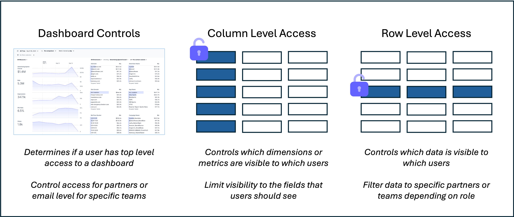

Rill supports granular access policies for dashboards. They allow the dashboard developer to configure dashboard-level, row-level and column-level restrictions based on user attributes such as email address and domain. Our goal with access to policies is to avoid dashboard sprawl by creating a single configuration of the dashboard that can then be sliced or restricted into multiple views via different policies. Using those access controls, a single dashboard can now serve dozens of teams and use cases to ensure consistent metric definitions and better dashboard findability.

Some of the typical use cases include:

- Restricting access to certain dashboards to admin users
- Limiting dashboards to relevent fields or metrics by team for ease of use (creating a lookup and filter by role) 
- Limiting access to sensitive dimensions or measures to users from a specific department
- Partner-filtered dashboards where external users can only see the subset of data that relates to them

:::note User Access vs. Access Policies
Access policies only apply to users who have been invited to access the project. They provide granular access control for your data, but are not the first layer of security for your project.
:::

## Configuration

You define access policies for dashboards under the `security` key in a dashboard's YAML file. The key properties are:

- **Dashboard-level access:** `access` – a boolean expression that determines if a user can or can't access the dashboard
- **Row-level access:** `row_filter` – a SQL expression that will be injected into the `WHERE` clause of all dashboard queries to restrict access to a subset of rows
- **Column-level access:** `include` or `exclude` – lists of boolean expressions that determine which dimension and measure names will be available to the user



See the [Dashboard YAML](/reference/project-files/dashboards) reference docs for all the available fields.

See the [Examples](#examples) below for how to set up each type of configuration.

## User attributes

When developing access policies, you can leverage a fixed set of user attributes to resolve access at runtime. The attributes are:

- `.user.email` – the current user's email address, for example `john.doe@example.com` (string)
- `.user.domain` – the domain of the current user's email address, for example `example.com` (string)
- `.user.name` - the current user's name, for example `John Doe` (string)
- `.user.admin` – a boolean value indicating whether the current user is an org or project admin, for example `true` (bool)
<!-- PENDING SUPPORT FOR USER-DEFINED USERGROUPS -->
<!-- - `.user.groups` - a list of usergroups the user belongs to in the project's org. Custom usergroups are not currently supported, so this will always be `["all"]`. -->

Note: Rill requires users to confirm their email address before letting them interact with the platform so a user cannot fake an email address or email domain.

If you require additional user attributes to enforce access policies, see the [example for custom attributes below](#advanced-example-custom-attributes) for more details.

## Templating and expression evaluation

When a user loads a dashboard, the policies are resolved in two phases:

1. The templating engine first replaces expressions like `{{ .user.domain }}` with actual values ([Templating reference](../deploy/templating.md))
2. The resulting expression is then evaluated contextually:
  - The `access` and `if` values are evaluated as SQL expressions and resolved to a `true` or `false` value
  - The `row_filter` value is injected into the `WHERE` clause of the SQL queries used to render the dashboard

## Testing your policies

In development (on `localhost`), you can test your policies by adding "mock users" to your project and viewing the dashboard as one of them.

In your project's `rill.yaml` file, add a `mock_users` section. Each mock user must have an `email` attribute, and can optionally have `name` and `admin` attributes. For example:
```yaml
# rill.yaml
mock_users:
- email: john@yourcompany.com
  name: John Doe
  admin: true
- email: jane@partnercompany.com
- email: anon@unknown.com
```

On the dashboard page (provided you've added a policy) you'll see a "View as" button in the top right corner. Click this button and select one of your mock users. You'll see the dashboard as that user would see it.

## Examples

### Restrict dashboard access to users matching specific criteria

Let's say you want to restrict dashboard access to admin users or users whose email domain is `example.com`. Add the following clause to your dashboard's YAML:
```yaml
security:
  access: "{{ .user.admin }} OR '{{ .user.domain }}' == 'example.com'"
```

:::note DEFAULT SECURITY IS FALSE
If the `security` section is defined and `access` is not, then `access` will default to `false`, meaning that it won't be accessible to anyone and users will need to invited individually.
:::

### Show only data from the user's own domain

You can limit the data available to the dashboard by applying a filter on the underlying data. Assuming the dashboard's underlying model has a `domain` column, adding the following clause to the dashboard's YAML will only show dimension and measure values for the current user's email domain:

```yaml
security:
  access: true
  row_filter: "domain = '{{ .user.domain }}'"
```

:::note FILTERS SHOULD BE VALID SQL
The `filter` value needs to be valid SQL syntax for a `WHERE` clause. It will be injected into every SQL query used to render the dashboard.
:::

### Conditionally hide a dashboard dimension or measure

You can include or exclude dimensions and measures based on a boolean expression. For example, to exclude a dimension named `ssn` and `id` for users whose email domain is not `example.com`:

```yaml
security:
  access: true
  exclude:
    - if: "'{{ .user.domain }}' != 'example.com'"
      names: 
        - ssn
        - id
```

Alternatively, you can explicitly define the dimensions and measures to include using the `include` key. It uses the same syntax as `exclude` and automatically excludes all names not explicitly defined in the list. See the [Dashboard YAML](/reference/project-files/dashboards) reference for details.

<!-- PENDING SUPPORT FOR USER-DEFINED USERGROUPS -->
<!--
### Filter queries based on the user's groups

Let's say additionally we want to filter queries based on user's groups and there exist a `group` dimension in the model:
```yaml 
security:
  access: true
  row_filter: "groups IN ('{{ .user.groups | join \"', '\" }}')"
```
-->

### Advanced Example: Custom attributes

For some use cases, the built-in user attributes do not provide sufficient context to correctly restrict access. For example, a dashboard for a multi-tenant SaaS application might have a `tenant_id` column and external users should only be able to see data for the tenant they belong to.

To support this, we can ingest a separate data [source](/build/connect) containing mappings of user email addresses to tenant IDs and reference it in the row-level filter.

For example, if we have a `mappings.csv` file in the `data` directory of our Rill project with the following contents:
```csv
email,tenant_id
john.doe@example.com,1
jane.doe@example.com,2
```
we can ingest it as a regular data source in Rill:
```yaml
# sources/mappings.yaml
type: local_file
path: data/mappings.csv
```
(In practice, you would probably ingest the data from a regularly updated export in S3.)

We can now refer to the mappings data using a SQL sub-query as follows:
```yaml
security:
  access: true
  row_filter: "tenant_id IN (SELECT tenant_id FROM mappings WHERE email = '{{ .user.email }}')"
```
